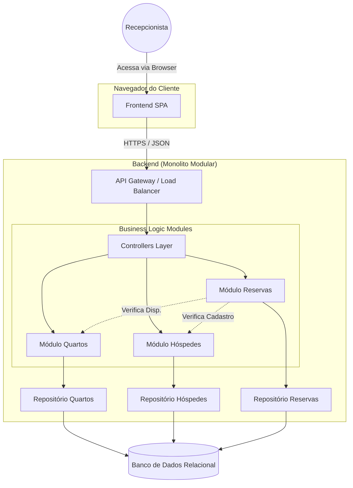

# Arquitetura do Sistema de Reserva de Hotel

## Descrição Geral

Para o Sistema de Reserva de Hotel, considerando que o domínio é um **único hotel** e o foco está em manutenibilidade, organização e facilidade de implantação, a arquitetura proposta é um **Monolito Modular em Camadas (Layered Modular Monolith)**.

### Por que Monolito Modular?
Uma arquitetura de microserviços adicionaria complexidade desnecessária (deploy, comunicação entre serviços, latência) para o escopo de um único hotel. O monolito modular permite:
- **Simplicidade Operacional**: Deploy único.
- **Isolamento de Domínio**: Módulos bem definidos (Quartos, Hóspedes, Reservas) que evitam o "Spaghetti Code".
- **Performance**: Comunicação interna direta (in-process calls) sem overhead de rede.
- **Evolução**: Facilidade para extrair microserviços no futuro, se necessário.

---

## Visão Geral das Camadas

O sistema será dividido em duas grandes partes físicas: **Frontend** (Cliente) e **Backend** (Servidor).

### 1. Frontend (Single Page Application - SPA)
Responsável pela interface com o usuário (Recepcionista).
- **Tecnologia Sugerida**: React.js, Vue.js ou Angular.
- **Responsabilidades**:
  - Renderização da UI.
  - Consumo da API REST do Backend.
  - Validações de formulário no lado do cliente.
  - Gestão de estado da aplicação.

### 2. Backend (API REST)
Responsável pela lógica de negócios e persistência de dados.
- **Estilo Arquitetural**: Camadas (Layers).
- **Tecnologia Sugerida**: Node.js (Express/NestJS), Python (Django/FastAPI) ou Java (Spring Boot).

#### Camadas do Backend

1.  **Interface Layer (API / Controllers)**
    - Recebe as requisições HTTP (GET, POST, PUT, DELETE).
    - Valida inputs básicos.
    - Delega para a camada de Serviços.
    - Retorna respostas JSON para o Frontend.

2.  **Application / Service Layer (Regras de Negócio)**
    - Contém a lógica de negócio (ex: "Não permitir reserva se quarto ocupado").
    - Orquestra as operações entre repositórios.
    - Implementa os Casos de Uso.
    - **Módulos**:
        - `ModuleQuartos`: Lógica de cadastro e gestão de quartos.
        - `ModuleHospedes`: Lógica de cadastro de hóspedes.
        - `ModuleReservas`: Lógica de criação e gestão de reservas.

3.  **Infrastructure / Persistence Layer (Dados)**
    - Acesso ao Banco de Dados (Repositories / DAOs).
    - Mapeamento Objeto-Relacional (ORM).
    - Integrações externas (se houver).

### 3. Banco de Dados
- **Tipo**: Relacional (SQL).
- **Tecnologia Sugerida**: PostgreSQL ou MySQL.
- **Justificativa**: Dados estruturados e relacionais (Reservas ligam Quartos e Hóspedes) exigem integridade referencial forte (Transactions, Foreign Keys).

---

## Diagrama Conceitual (Mermaid)

---

## Justificativa da Escolha Arquitetural

A escolha pelo **Monolito Modular** é baseada nos seguintes pilares:

### 1. Desempenho (Performance)
- **Latência Zero entre Módulos**: A comunicação entre serviços (ex: Reserva consultando disponibilidade de Quarto) ocorre em memória (chamada de função), o que é ordens de grandeza mais rápido do que chamadas de rede HTTP/gRPC exigidas em microserviços.
- **Transações ACID**: O uso de um banco de dados relacional único permite transações atômicas nativas. Garantir consistência em reservas (travar quarto ao reservar) é trivial e performático, sem necessidade de padrões complexos como Sagas ou Two-Phase Commit.
- **Cache Simplificado**: O compartilhamento de cache (Redis, por exemplo) é mais direto, pois todas as instâncias acessam os mesmos dados de referência.

### 2. Escalabilidade
- **Escalabilidade Horizontal**: Para um único hotel, o tráfego esperado não justifica escalar módulos independentemente (ex: escalar só o serviço de busca). O monolito pode ser escalado horizontalmente (múltiplas réplicas atrás de um Load Balancer) de forma simples e eficiente para lidar com picos de acesso.
- **Simplicidade de Infraestrutura**: Não requer orquestradores complexos (Kubernetes com Service Mesh), reduzindo custos de nuvem e manutenção de infraestrutura.

### 3. Manutenibilidade e Evolução
- **Organização de Código**: Ao usar módulos bem definidos, mantemos o acoplamento baixo e a coesão alta. Cada equipe (ou desenvolvedor) pode trabalhar em um módulo com impacto controlado nos outros.
- **Facilidade de Refatoração**: Mudar interfaces ou mover lógica entre módulos é uma operação de refatoração de código segura, apoiada pela IDE e compilador, ao invés de contratos de API distribuídos que exigem versionamento estrito.
- **Testabilidade**: Testes de integração e end-to-end são muito mais fáceis de configurar e rodar em um ambiente único do que orquestrar múltiplos contêineres e bancos de dados.
- **Curva de Aprendizado**: Para novos desenvolvedores, entender um codebase unificado e bem estruturado é mais rápido do que navegar por múltiplos repositórios e serviços.
