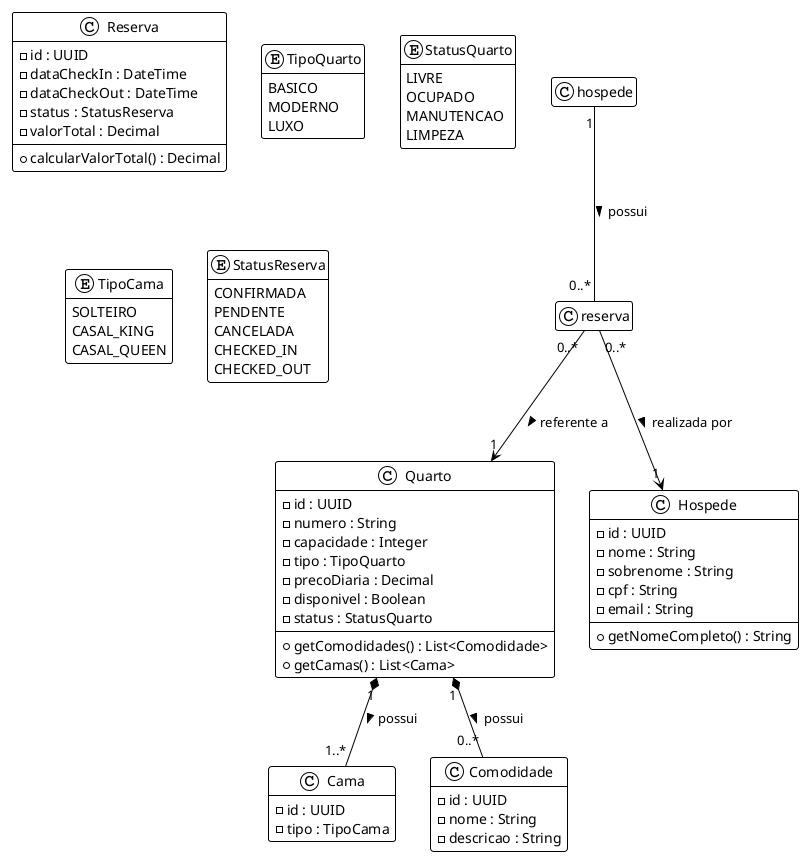

# Diagrama de Classes - Sistema de Reserva de Hotel

Este documento representa as classes de domínio, seus atributos e relacionamentos.

## Código PlantUML

## Descrição das Classes

1.  **Quarto**: Entidade central que representa a unidade de alojamento. Possui atributos descritivos e relacionamentos com Camas e Comodidades.
2.  **Hóspede**: Representa o cliente que realiza a reserva. O CPF é o identificador único de negócio.
3.  **Reserva**: Associação entre um Hóspede e um Quarto por um período de tempo definido (CheckIn/CheckOut).
4.  **Cama / Comodidade**: Entidades auxiliares (Value Objects ou Entidades fracas) que compõem as características do Quarto.
5.  **Enums**: `TipoQuarto`, `StatusQuarto`, `TipoCama` e `StatusReserva` normalizam os valores possíveis para atributos de domínio.
