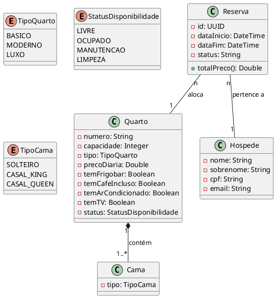

# Diagrama de Classes Principal

Este diagrama representa as entidades de domínio e seus relacionamentos no sistema de reservas.

## Detalhes das Entidades
- **Quarto**: Agrega as características físicas e o estado operacional (disponibilidade).
- **Cama**: Entidade vinculada ao Quarto para definir a configuração de dormitório.
- **Hóspede**: Entidade central para identificação do cliente.
- **Reserva**: Gerencia o vínculo temporal entre o cliente e o patrimônio do hotel (quarto).
