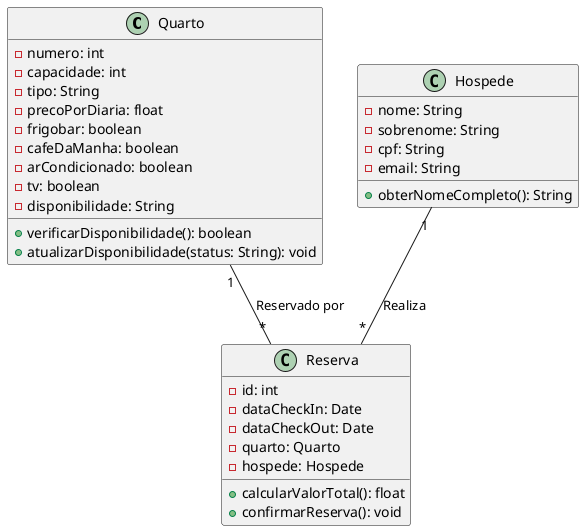

# Diagrama de Classes

## Representação em PlantUML

## Descrição das Classes

### **Quarto**
- **Atributos**:
  - `numero`: Número do quarto.
  - `capacidade`: Capacidade máxima de hóspedes.
  - `tipo`: Tipo do quarto (Básico, Moderno, Luxo).
  - `precoPorDiaria`: Preço por diária.
  - `frigobar`: Indica se há frigobar.
  - `cafeDaManha`: Indica se o café da manhã está incluso.
  - `arCondicionado`: Indica se há ar-condicionado.
  - `tv`: Indica se há TV.
  - `disponibilidade`: Status do quarto (Ocupado, Livre, Manutenção, Limpeza).
- **Métodos**:
  - `verificarDisponibilidade()`: Retorna se o quarto está disponível.
  - `atualizarDisponibilidade(status)`: Atualiza o status do quarto.

### **Hóspede**
- **Atributos**:
  - `nome`: Nome do hóspede.
  - `sobrenome`: Sobrenome do hóspede.
  - `cpf`: CPF do hóspede.
  - `email`: Email do hóspede.
- **Métodos**:
  - `obterNomeCompleto()`: Retorna o nome completo do hóspede.

### **Reserva**
- **Atributos**:
  - `id`: Identificador único da reserva.
  - `dataCheckIn`: Data de entrada.
  - `dataCheckOut`: Data de saída.
  - `quarto`: Quarto reservado.
  - `hospede`: Hóspede que realizou a reserva.
- **Métodos**:
  - `calcularValorTotal()`: Calcula o valor total da reserva com base nas diárias.
  - `confirmarReserva()`: Confirma a reserva.

---

## Relacionamentos
- **Quarto** e **Reserva**: Um quarto pode estar associado a várias reservas, mas cada reserva está vinculada a um único quarto.
- **Hóspede** e **Reserva**: Um hóspede pode realizar várias reservas, mas cada reserva está vinculada a um único hóspede.