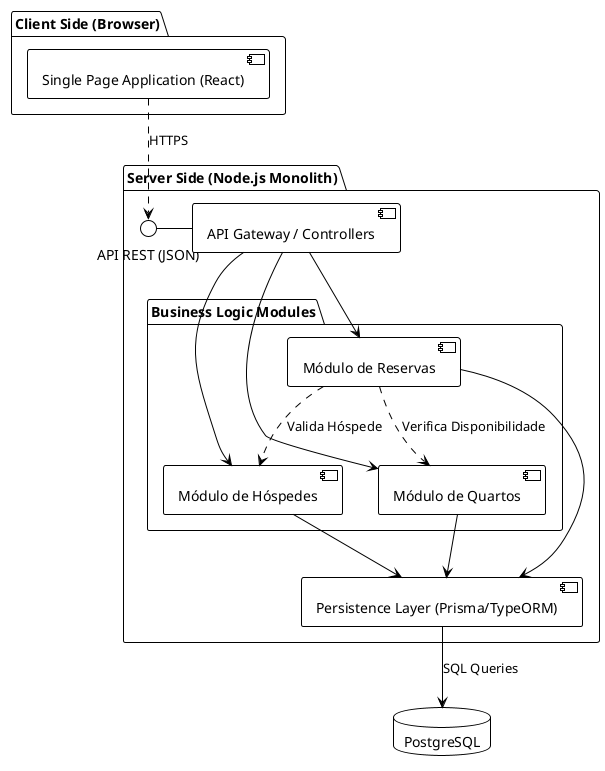

# Diagrama de Componentes - Sistema de Reserva de Hotel

Este documento contém a representação dos componentes do sistema utilizando a notação UML (PlantUML).

## Código PlantUML

## Descrição dos Componentes

1.  **SPA (React)**: Aplicação web que o recepcionista utiliza.
2.  **API Gateway / Controllers**: Ponto de entrada das requisições, validação de input e roteamento.
3.  **Módulos de Negócio**:
    *   **Quartos**: Gerencia tipos de quartos, camas e status.
    *   **Hóspedes**: Gerencia cadastro de clientes.
    *   **Reservas**: Orquestra a criação de reservas, garantindo regras de negócio (ex: não reservar quarto ocupado).
4.  **Persistence Layer**: Abstração do banco de dados (ORM) para realizar operações CRUD.
5.  **PostgreSQL**: Armazenamento persistente relacional.
