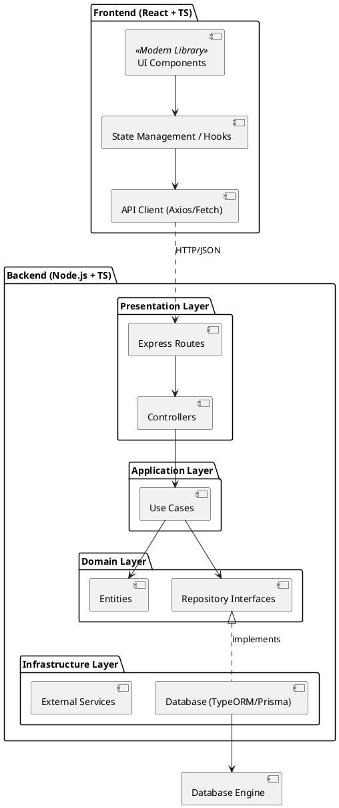

# Diagrama de Componentes

Este diagrama utiliza a sintaxe PlantUML para descrever a organização modular do sistema.

## Descrição das Interações
1. **Frontend** envia requisições JSON via **API Client**.
2. **Presentation Layer** recebe a requisição e delega para o **Caso de Uso** correspondente.
3. **Application Layer** executa a lógica de negócio utilizando as **Entidades**.
4. A persistência é feita via **Inversão de Dependência**: a aplicação usa interfaces, e a **Infrastructure** provê a implementação real (Banco de Dados).
