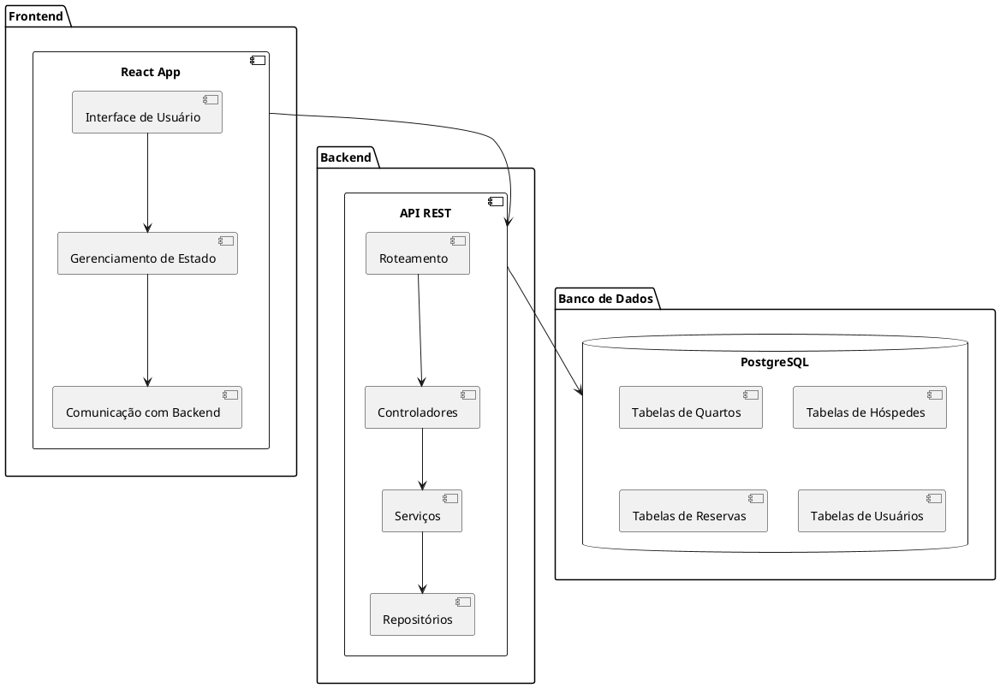

# Diagrama de Componentes

## Representação em PlantUML

## Descrição dos Componentes

### **Frontend**
- **React App**: Responsável pela interface do usuário e pela interação com o backend.
  - **Interface de Usuário**: Componentes visuais e responsivos.
  - **Gerenciamento de Estado**: Controle do estado global da aplicação (ex.: Redux ou Context API).
  - **Comunicação com Backend**: Realiza chamadas HTTP para a API REST.

### **Backend**
- **API REST**: Gerencia a lógica de negócios e fornece endpoints para o frontend.
  - **Roteamento**: Define as rotas da aplicação.
  - **Controladores**: Processam as requisições e chamam os serviços necessários.
  - **Serviços**: Contêm a lógica de negócios.
  - **Repositórios**: Gerenciam a comunicação com o banco de dados.

### **Banco de Dados**
- **PostgreSQL**: Armazena os dados do sistema de forma estruturada.
  - **Tabelas de Quartos**: Informações sobre os quartos disponíveis.
  - **Tabelas de Hóspedes**: Dados dos hóspedes cadastrados.
  - **Tabelas de Reservas**: Detalhes das reservas realizadas.
  - **Tabelas de Usuários**: Credenciais e permissões dos usuários do sistema.

---

## Fluxo de Comunicação
1. O usuário interage com a **Interface de Usuário** no **React App**.
2. O **Gerenciamento de Estado** controla os dados exibidos e enviados.
3. O **React App** realiza chamadas HTTP para a **API REST** no backend.
4. A **API REST** processa as requisições, aplicando a lógica de negócios.
5. O backend acessa o **PostgreSQL** para armazenar ou recuperar dados.
6. O backend retorna os dados processados ao frontend, que atualiza a interface do usuário.